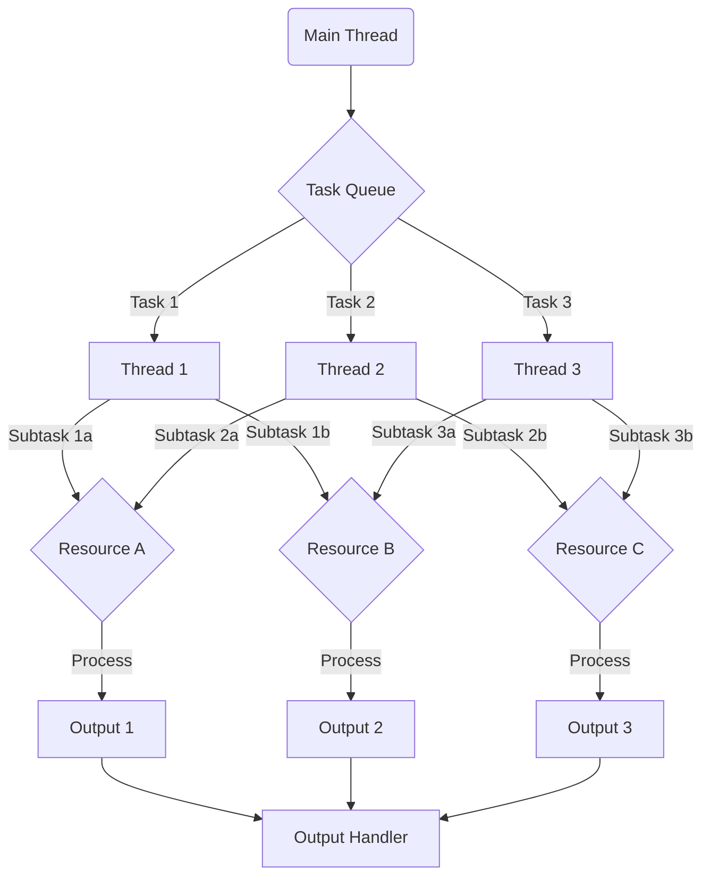
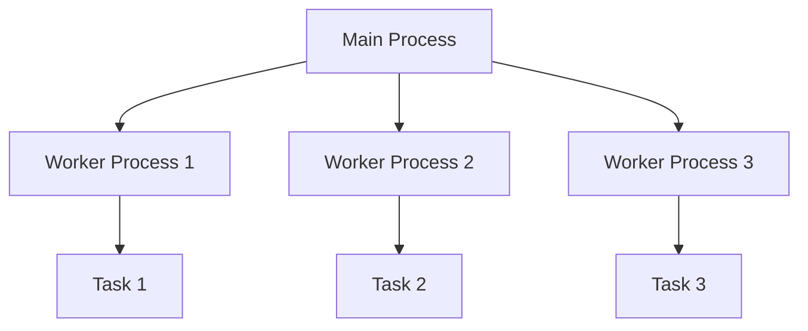
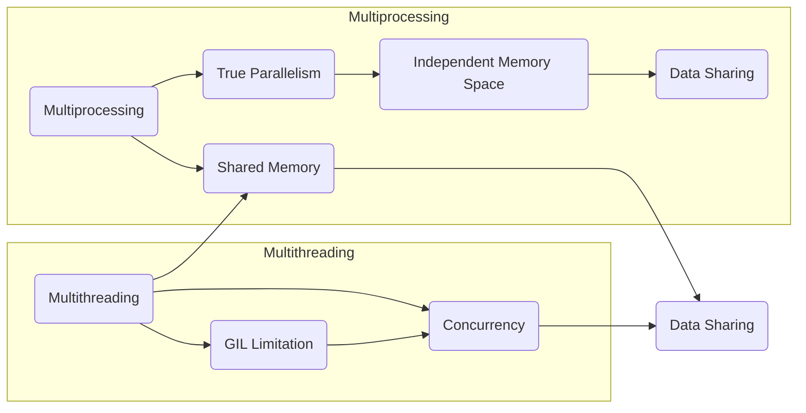

# Miscellaneous tools

---

## Multi-Threading

In Python, multithreading is a technique used to achieve parallel execution of multiple threads within a single process.
It allows different parts of a program to execute concurrently, improving performance and responsiveness.

Python's `threading` module provides a high-level interface for creating and managing threads. Here's a brief
explanation of how multithreading works in Python:

1. **Threads**: A thread is a separate flow of execution within a program. It consists of a series of instructions that
   are executed independently of other threads. Python's `threading.Thread` class is used to create and manage threads.

2. **Global Interpreter Lock (GIL)**: In CPython (the default implementation of Python), there is a Global Interpreter
   Lock (GIL) that allows only one thread to execute Python bytecode at a time. This means that even with multiple
   threads, only one thread can execute Python code at a given moment. As a result, multithreading in Python does not
   provide true parallelism for CPU-bound tasks.

3. **Concurrency vs. Parallelism**: While multithreading in Python may not achieve parallelism for CPU-bound tasks due
   to the GIL, it can still provide concurrency for I/O-bound tasks. Concurrency means that multiple threads can execute
   in an interleaved manner, making progress even if they are not executing simultaneously.

4. **Thread Synchronization**: When multiple threads access shared resources (e.g., variables, data structures), it's
   crucial to ensure proper synchronization to avoid data races and inconsistencies. Python provides various
   synchronization primitives like locks, semaphores, and condition variables from the `threading` module to manage
   thread synchronization.

5. **Thread Communication**: Threads can communicate and coordinate with each other through shared data structures or
   synchronization primitives. Python provides `Queue` objects from the `queue` module, which can be used to safely
   exchange data between threads.

6. **Thread Pooling**: To efficiently manage and reuse threads, Python's `concurrent.futures` module provides a
   high-level interface for thread pooling. Thread pooling involves creating a fixed number of threads upfront and using
   them to execute multiple tasks. This approach avoids the overhead of thread creation and deletion for each task.

It's important to note that multithreading in Python is most effective for I/O-bound tasks, such as network requests,
file I/O, or waiting for user input. For CPU-bound tasks, parallelism can be achieved using multiprocessing or by
leveraging other concurrency models like asynchronous programming with coroutines (e.g., `asyncio`).

Overall, Python's multithreading allows for concurrent execution of multiple threads, enabling efficient utilization of
system resources and better responsiveness for I/O-bound tasks. However, due to the GIL, it does not provide true
parallelism for CPU-bound tasks. For CPU-bound parallelism, multiprocessing or asynchronous programming should be
considered.

## Multiprocessing in Python

Multiprocessing is a technique in Python that allows for the execution of multiple processes in parallel. It leverages
the `multiprocessing` module, which provides a high-level interface for creating and managing processes.

### Key Concepts

1. **Process**: A process is an instance of a program that runs independently and has its own memory space. Each process
   executes its instructions separately, allowing for true parallelism.

2. **Pool**: The `multiprocessing.Pool` class provides a convenient way to manage a pool of worker processes. It
   abstracts away the complexities of process creation and management.

3. **Parallel Execution**: With multiprocessing, multiple processes can execute tasks concurrently, utilizing the
   available CPU cores to improve performance.

4. **Shared Memory**: Processes can communicate and share data using shared memory objects like `multiprocessing.Array`
   and `multiprocessing.Value`. These objects allow multiple processes to access and modify shared data without
   conflicts.

### Usage Steps

To use multiprocessing in Python, follow these steps:

1. Import the `multiprocessing` module: `import multiprocessing`.

2. Define the function that will be executed in parallel.

3. Create an instance of the `Pool` class: `pool = multiprocessing.Pool()`.

4. Use the pool to apply the function to the data in parallel:
    - For parallel execution of a function on an iterable, use `pool.map()`.
    - For parallel execution with different arguments, use `pool.starmap()`.

5. Obtain the results of the parallel execution.

6. Close the pool to release the resources: `pool.close()`.

7. Optionally, wait for the processes to finish: `pool.join()`.

### Benefits and Considerations

- **Improved Performance**: Multiprocessing allows for parallel execution, utilizing multiple CPU cores and improving
  performance, especially for CPU-intensive tasks.

- **Isolation**: Each process runs in its own memory space, providing isolation and preventing interference between
  processes.

- **GIL Limitation**: In CPython, the Global Interpreter Lock (GIL) allows only one thread to execute Python bytecode at
  a time. This limitation prevents true parallelism in Python's multithreading. However, multiprocessing can overcome
  this limitation by running separate processes.

- **Process Overhead**: Creating and managing processes incurs additional overhead compared to threads. The cost of
  inter-process communication and memory usage should be considered for optimal performance.

- **Shared Memory Considerations**: When multiple processes access shared data, proper synchronization mechanisms, such
  as locks or queues, should be used to prevent race conditions and ensure data integrity.

Multiprocessing in Python offers a powerful way to achieve parallelism, improving performance for CPU-intensive tasks.
By utilizing multiple processes, it overcomes the limitations imposed by the Global Interpreter Lock (GIL) in Python's
multithreading. However, process creation and management introduce additional overhead, and shared memory requires
careful synchronization to maintain data consistency.

> The MultiProcessing class provides the following methods and attributes:

- THREADS: Class attribute that represents the number of threads available on the system.
- method: An instance attribute of the MultiProcessingFunction enum type that specifies the method used for
  multithreading (STARMAP or IMAP_UNORDERED).
- function: An instance attribute that stores the function to be executed in parallel.
- arguments: An instance attribute that holds the arguments for the function.
- results: An instance attribute that stores the results of the multithreaded execution.

> The class also contains the following methods:

- `__init__`(self, method: MultiProcessingFunction = None): Initializes the MultiProcessing object. If the method
  parameter is provided, it sets the multithreading method accordingly.
- `__multhreading_input_formatter`(primary_arg, *args): A static method that formats the input for the
  multiprocessing.Pool.starmap function. It takes an iterable object primary_arg and any additional arguments args that
  need to be repeated for each item in primary_arg. It returns a zip object with the same length as primary_arg.
- `__call__`(self, __func, __primary_arg, *args): This method allows calling the multithreading function. It takes the
  function __func, an iterable __primary_arg, and any additional arguments args that need to be repeated for each item
  in __primary_arg. It sets the function and arguments attributes accordingly and returns the result of the run()
  method.
- `run`(self): Runs the multithreading function based on the specified method. It uses the multiprocessing.Pool class to
  execute the function in parallel using multiple threads. If the method is STARMAP, it uses starmap to execute the
  function with the provided arguments. If the method is IMAP_UNORDERED, it uses imap_unordered instead. It returns an
  iterable object with the responses.
- `__repr__`(self): Represents the MultiProcessing object as a string, indicating the chosen method.
- `__del__`(self): Deletes the MultiProcessing object when it is no longer in use.

This class provides a convenient way to perform multithreading operations by specifying the method and passing the
function and its arguments. It leverages the multiprocessing module to execute the function in parallel, enhancing
performance in scenarios where parallel processing is possible.

---

## Multiprocessing vs Multithreading 

Certainly! Here's an explanation of the differences between multithreading and multiprocessing using a Markdown table:

| **Aspect**                     | **Multithreading**                                             | **Multiprocessing**                                               |
|-------------------------------|----------------------------------------------------------------|------------------------------------------------------------------|
| Execution Model               | Concurrent execution of multiple threads within a single process | Parallel execution of multiple processes                          |
| Memory Space                  | Threads share the same memory space (shared memory)             | Processes have independent memory spaces (isolated memory)        |
| Synchronization               | Thread synchronization is required to manage shared data        | Inter-process communication mechanisms for coordination          |
| Communication                 | Threads can communicate and coordinate using shared data        | Processes communicate using inter-process communication methods   |
| GIL Limitation                | Affected by the Global Interpreter Lock (GIL)                   | Overcomes GIL limitation, enabling true parallelism               |
| CPU Utilization               | May not fully utilize multiple CPU cores for CPU-bound tasks    | Can utilize multiple CPU cores for CPU-bound tasks                |
| Overhead                      | Less overhead in process creation and management                | Additional overhead in process creation and inter-process communication |
| Data Integrity                | Requires careful synchronization to prevent data races          | Requires synchronization mechanisms to ensure data integrity     |
| Use Cases                     | Suitable for I/O-bound tasks, such as network requests          | Suitable for CPU-bound tasks that benefit from parallel processing |

This table summarizes the key differences between multithreading and multiprocessing in terms of their execution models, memory space, synchronization, communication, GIL limitations, CPU utilization, overhead, data integrity, and use cases. It provides a quick overview of the distinctions between these concurrency approaches in Python.